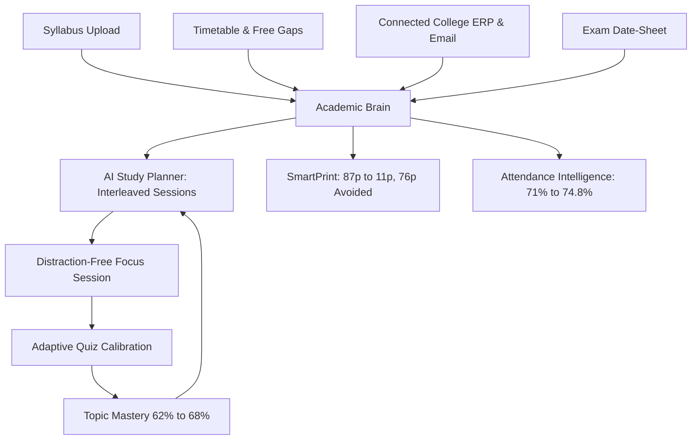

# 🌱 EcoStudy AI

> **Study smarter. Print less. Stay on track.**  
> *AI-Powered Academic Resource Optimizer & Student Command Center*

---

## 🌟 Product Overview & Core Differentiator

EcoStudy AI replaces fragmented college portals, disconnected note apps, and indiscriminate campus printing with a unified, continuous academic ecosystem:



### The Connected Student Ecosystem
1. **Aditya Raj** (B.Tech CSE, Sem 5) opens his **Dashboard**.
2. **College Ecosystem Banner** confirms active synchronization:
   - 📜 **4 Course Syllabi** (units, credit points, mark allocations)
   - ⏰ **15 Class Slots** (mapped lectures, labs, and AI-identified free study windows)
   - 📅 **4 Exam Dates** (with countdown curves)
   - 📧 **Connected College Email** (`aditya.raj@nit.ac.in` - actively parsing ERP notifications)
3. **AI Academic Guide Card**:
   - Detects a **2-hour free timetable window** (1:00 PM – 3:00 PM) after DSA Lab.
   - Cross-references incoming email alert from ERP: *Electronics attendance is 70.8% with Midterm in 10 days*.
   - Slots JFET & Tree Traversals directly into the free gap.
4. **SmartPrint (`/smartprint`)**:
   - Reduces 87-page DSA module to **11 high-yield pages** (AVL rotations, BST deletion proofs, recurrence formulas).
   - Avoids **76 pages of paper waste**, saving water and CO2.
5. **Attendance Intelligence (`/attendance`)**:
   - Models *“What if I miss 1 class?”* (drops to 69.6%) vs *“What if I attend next 4?”* (rises to 74.8%).
   - **“Add to Today’s Plan”** syncs Electronics into the AI Study Planner.
6. **Focus Session (`/focus`)**:
   - 45-minute countdown timer with embedded cheat sheets and formula references.
   - Logs understanding rating (*Mastered*) and transitions to the **Adaptive Quiz**.
7. **Adaptive Quiz (`/quiz`)**:
   - Active recall quiz verifying tree traversals and AVL balance conditions.
   - Calibrates topic mastery (**62% → 68%**).
   - **“Add 15 min revision tomorrow”** schedules immediate follow-up.
8. **Academic Sync Hub (`/sync`)**:
   - Connect or change college email with live parsed notices feed.
   - Timetable visualizer with free study gap detector.
   - Syllabus units and credit weightage breakdown.
   - Official exam date-sheet schedule.

---

## 🚀 Quickstart & Local Execution

### Prerequisites
- Node.js (v18+)
- npm (v9+)

### Installation & Launch
```bash
# 1. Install dependencies
npm install

# 2. Launch Vite development server
npm run dev

# App will be accessible at:
# http://127.0.0.1:5173/
```

### Production Build Validation
```bash
npm run build
npm run preview
```

---

## 📱 Routes & Features

| Route | Feature | Key Functionality |
|---|---|---|
| `/` | **Dashboard** | Personalized greeting, College Sync banner, AI Academic Guide, 4 metrics, Today's plan, Timetable gap tracker, Latest ERP email alert |
| `/sync` | **Academic Sync Hub** | 4 Feeds: College Email (`aditya.raj@nit.ac.in`), Class Timetable & Free Gaps, Uploaded Syllabi, Exam Date-sheet |
| `/materials` | **Study Materials** | Document library, stepped drag-and-drop upload simulation, page count badges |
| `/materials/:id` | **Material Analysis** | Topic breakdown (High/Medium/Low priority), key formulas, interactive recall question |
| `/smartprint` | **SmartPrint** | 87p → 11p comparison, 76p avoided hero metric, selectable page grid, print pack generator |
| `/attendance` | **Attendance Intelligence** | Subject status cards, dynamic miss/attend calculator, hall-ticket protection, planner sync |
| `/planner` | **AI Study Planner** | 7-day adaptive timeline, AI reasoning panel, algorithmic schedule regeneration |
| `/focus` | **Focus Session** | Interactive countdown timer, summary/formula tabs, post-session rating modal |
| `/quiz` | **Adaptive Quiz** | Instant option feedback, explanations, mastery calibration (62% → 68%), revision task insertion |
| `/analytics` | **Analytics** | Study hours bar chart, mastery progress, 75% cutoff threshold reference line, cumulative paper saved area chart |
| Global | **EcoStudy AI Copilot** | Floating assistant drawer with quick prompts and contextual academic guidance (timetable, emails, syllabus, exams) |
